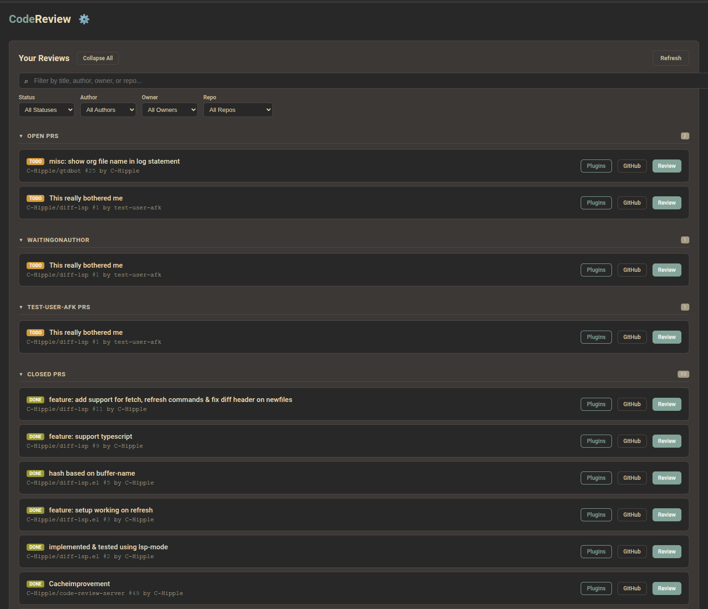
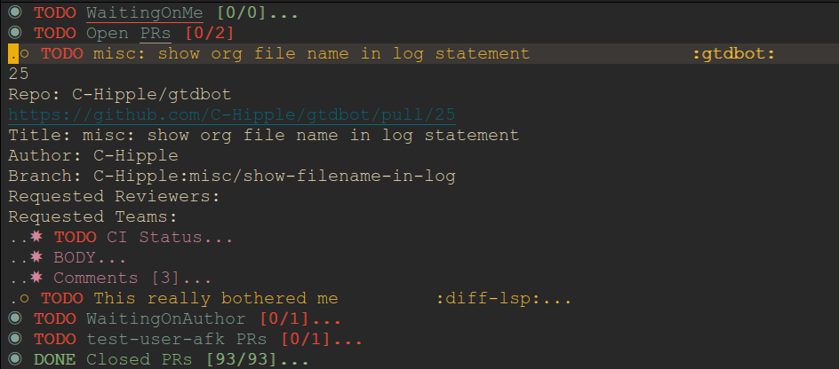

# code-review-server

code-review-server is a service which runs highly configurable workflows to load code reviews which you are interested into easily managed customizable interfaces.

It also supports doing local code reviews via your preferred client, allowing you to customize your experience such as doing them in your editor, using plugins, defining hotkeys, whatever you'd like.

It is designed to be client-agnostic, communicating via JSON-RPC. It ships with a web client (bun/react) and an emacs client.

web client review list


Emacs client review list


## Documentation

Full documentation is available at [https://code-review-server.readthedocs.io/en/latest/](https://code-review-server.readthedocs.io/en/latest/)

- [Configuration](https://code-review-server.readthedocs.io/en/latest/configuration/)
- [Clients](https://code-review-server.readthedocs.io/en/latest/clients/)
- [Filters](https://code-review-server.readthedocs.io/en/latest/filters/)
- [Plugins](https://code-review-server.readthedocs.io/en/latest/plugins/)
- [Protocol](https://code-review-server.readthedocs.io/en/latest/protocol/)

## Quickstart

1.  **Clone the repository**

[Repo](https://www.github.com/C-Hipple/code-review-server)

2.  **Configure environment**

    Create your config at `~/.config/codereviewserver.toml` (see [Configuration](docs/configuration.md)).

    ```bash
    export CRS_GITHUB_TOKEN="Github Token"  # Required.
    export GEMINI_API_KEY="Gemini Token"  # Only necessary for plugin use.
    ```

    Minimal `~/.config/codereviewserver.toml`:
    ```toml
    Repos = ["owner/repo"]
    GithubUsername = "your-username"
    AutoWorktree = true

    [[Workflows]]
    WorkflowType = "SyncReviewRequestsWorkflow"
    Name = "My PRs"
    Filters = ["FilterMyPRs"]
    SectionTitle = "PRs to Review"

    [[Workflows]]
    WorkflowType = "SyncReviewRequestsWorkflow"
    Name = "PRs to Review"
    Filters = ["FilterNotDraft", "FilterMyReviewRequested"]
    SectionTitle = "PRs to Review"

    [[Plugins]]
    Name = "Summarize Diff"
    Command = "summarize_diff"
    IncludeDiff = true
    IncludeHeaders = true
    IncludeComments = true
    ```

3.  **Install Server**

    >  Alternatively, use Docker Compose to run steps 3 and 4 containerized with `docker compose up`.

    ```bash
    go install ./...
    ```

    This installs the server binary and included plugins to your `$GOPATH/bin`.

4.  **Run a Client**

    See [Clients](docs/clients.md) for detailed instructions on running the Web or Emacs clients.

    **Web Client (Brief):**
    ```bash
    cd bun_client
    bun install && bun run build
    bun start
    ```

    **Emacs Client (Brief):**
    Evaluate `client.el/crs-client.el` and run `(crs-start-server)`.
