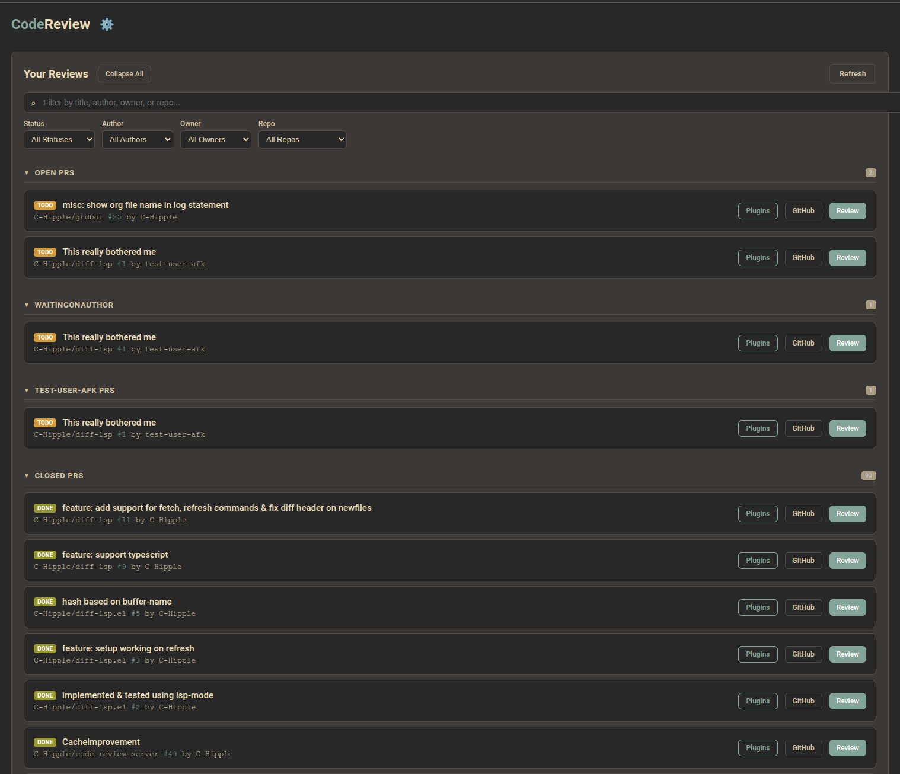
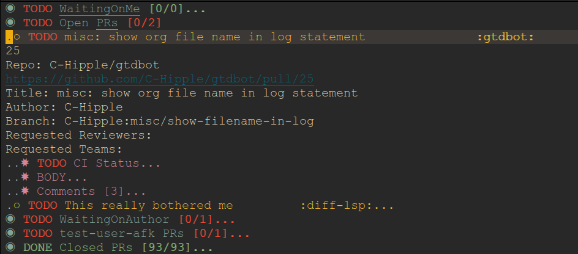

# code-review-server

code-review-server is a service which runs highly configurable workflows to load code reviews which you are interested into easily managed customizable interfaces.

It also supports doing local code reviews via your preferred client, allowing you to customize your experience such as doing them in your editor, using plugins, defining hotkeys, whatever you'd like.

It is designed to be client-agnostic, communicating via JSON-RPC. It ships with a web client (bun/react), an emacs client, a TUI client (rust), and a Chrome extension that brings the AI features and plugins to the GitHub pull request you are on.

web client review list


Emacs client review list


## Documentation

Full documentation is available at [https://code-review-server.readthedocs.io/en/latest/](https://code-review-server.readthedocs.io/en/latest/)

- [Configuration](https://code-review-server.readthedocs.io/en/latest/configuration/)
- [Clients](https://code-review-server.readthedocs.io/en/latest/clients/)
- [Filters](https://code-review-server.readthedocs.io/en/latest/filters/)
- [Plugins](https://code-review-server.readthedocs.io/en/latest/plugins/)
- [AI Features](https://code-review-server.readthedocs.io/en/latest/ai_features/)
- [Protocol](https://code-review-server.readthedocs.io/en/latest/protocol/)

## Quickstart

1.  **Clone the repository**

[Repo](https://www.github.com/C-Hipple/code-review-server)

2.  **Configure environment**

    ```bash
    export CRS_GITHUB_TOKEN="Github Token"  # Required.
    export GEMINI_API_KEY="Gemini Token"  # Only for plugins and AI features on the gemini provider.
    export OPENROUTER_API_KEY="OpenRouter Key"  # Only for AI features and plugins configured to use the openrouter provider.
    ```

    That token is the only required setup. With no config file, the server runs a built-in default configuration — a **Waiting On Me** section and a **Review Requested** section, found through GitHub search and identified by whoever the token belongs to. No repo list, no username.

    To customize, start from those defaults and edit (see [Configuration](docs/configuration.md)):

    ```bash
    codereviewserver -print-default-config > ~/.config/codereviewserver.toml
    ```

    A fuller `~/.config/codereviewserver.toml`, once you know which repos you care about:
    ```toml
    Repos = ["owner/repo"]
    GithubUsername = "your-username"
    AutoWorktree = true

    [[Workflows]]
    WorkflowType = "SyncReviewRequestsWorkflow"
    Name = "My PRs"
    Filters = ["FilterMyPRs"]
    SectionTitle = "PRs to Review"

    [[Workflows]]
    WorkflowType = "SyncReviewRequestsWorkflow"
    Name = "PRs to Review"
    Filters = ["FilterNotDraft", "FilterMyReviewRequested"]
    SectionTitle = "PRs to Review"

    [[Plugins]]
    Name = "Summarize Diff"
    Command = "summarize_diff"
    IncludeDiff = true
    IncludeHeaders = true
    IncludeComments = true
    ```

3.  **Install Server**

    >  Alternatively, use Docker Compose to run steps 3 and 4 containerized with `docker compose up`.

    ```bash
    go install ./...
    ```

    This installs the server binary and included plugins to your `$GOPATH/bin`.

4.  **Run a Client**

    See [Clients](docs/clients.md) for detailed instructions on running the Web, TUI or Emacs clients, or the Chrome extension ([chrome_extension/README.md](chrome_extension/README.md)).

    **Web Client (Brief):**
    ```bash
    cd bun_client
    bun install && bun run build
    bun start
    ```

    **Emacs Client (Brief):**
    Evaluate `client.el/crs-client.el` and run `(crs-start-server)`.

    **Chrome Extension (Brief):**
    ```bash
    cd chrome_extension
    bun install && bun run build
    ./crs_native_host/install.sh --capture-env  # in a shell with CRS_GITHUB_TOKEN set
    ```
    Then load `chrome_extension/dist` with **Load unpacked** on `chrome://extensions` (Developer mode on).
