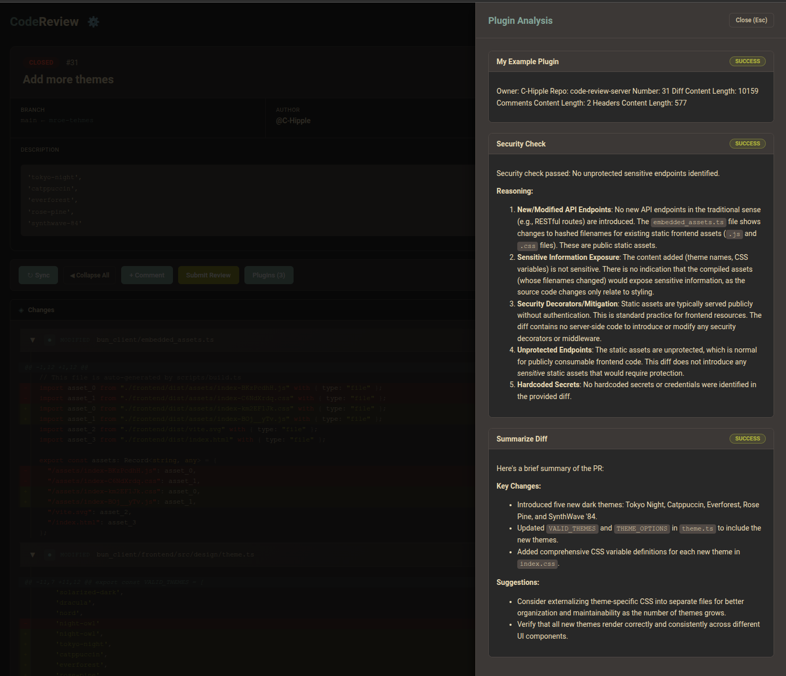

# Plugins

Plugins are external projects which are expected to be discoverable on your `$PATH`, and are called per PR.
You can install external plugins to process PR data asynchronously. Plugins receive data via CLI flags and their output is stored in the database.



This image shows the plugin output in the bun_client when reviewing a PR in this repository.

## Configuration

Add plugins to your `codereviewserver.toml` using `[[Plugins]]` tables:

```toml
[[Plugins]]
Name = "Summarize Diff"
Command = "summarize_diff"
IncludeDiff = true     # Passes --diff flag
IncludeHeaders = true  # Passes --headers flag (metadata)
IncludeComments = true # Passes --comments flag

[[Plugins]]
Name = "Security Check"
Command = "security_check"
IncludeDiff = true
IncludeHeaders = true
IncludeComments = false

[[Plugins]]
Name = "Claude Review"
Command = "claude_review"
IncludeDiff = false
IncludeHeaders = false
IncludeComments = false
IncludeBranch = true   # Passes --branch flag (PR head branch name)

[[Plugins]]
Name = "Expensive Analysis"
Command = "expensive_analysis"
IncludeDiff = true
OnlyOnDemand = true    # This plugin only runs when explicitly requested
```

### Plugin Configuration Options

- `Name` (string, required): Display name for the plugin
- `Command` (string, required): Executable name on your `$PATH`
- `IncludeDiff` (bool, optional): Pass the PR diff via `--diff` flag
- `IncludeHeaders` (bool, optional): Pass PR metadata via `--headers` flag (includes `head_ref` among other fields)
- `IncludeComments` (bool, optional): Pass PR comments via `--comments` flag
- `IncludeBranch` (bool, optional): Pass the PR's head branch name via `--branch` flag
- `OnlyOnDemand` (bool, optional, default: false): If true, plugin only runs when explicitly requested via RerunPlugins

> **Note:** The branch name is also available in the `--headers` JSON as the `head_ref` field. Use `IncludeBranch` when you want the branch as a simple standalone argument without parsing the full metadata JSON.

## Included Plugins

- **Summarize Diff**: Uses Gemini 2.5 Flash to provide a terse bulleted summary of the changes in a PR. Emits the [response contract](#plugin-response-contract): a markdown body holding the summary, plus up to six annotations anchored to the lines worth a reviewer's attention.
- **Security Check**: Uses Gemini 2.5 Flash to analyze the diff for potential security risks, specifically looking for unprotected sensitive endpoints, hardcoded secrets, or missing security decorators (like `@authenticated`).
- **Style Guidelines**: Uses Gemini 2.5 Flash to evaluate a PR's diff against your personal style guide. Reads rules from `~/.config/style_guidelines.md` and reports violations, compliance highlights, and an overall assessment. Emits the [response contract](#plugin-response-contract): a markdown body holding the report, plus an annotation on each line that breaks a guideline. Requires `GEMINI_API_KEY`. See [Style Guidelines Plugin](#style-guidelines-plugin) below.
- **Claude Review**: Runs `claude -p "review PR #<number> on repo <owner>/<repo>" --model sonnet` via the Claude CLI. Written in Zig. Build with `zig build` inside `cmd/claude_review/` and place the resulting binary on your `$PATH`.

Plugins are expected to accept flags like `--owner`, `--repo`, `--number`, `--call-type`, and any of the optional content flags enabled above (`--diff`, `--headers`, `--comments`, `--branch`).

## Call Types

Every invocation carries a `--call-type` flag naming why the plugin is being run, so a plugin can behave differently on a rerun than it does on the server's own scheduled runs.

| Value       | When it's passed                                                                       |
|-------------|----------------------------------------------------------------------------------------|
| `automatic` | The server triggered the run itself, because a PR was fetched or its head SHA changed. |
| `explicit`  | A deferred (`OnlyOnDemand = true`) plugin was requested by name via `RerunPlugins`. These plugins never run automatically, so any run of one is an explicit request. |
| `rerun`     | A plugin that would otherwise run automatically was rerun via `RerunPlugins`. |

`--call-type` is passed on **every** invocation, alongside `--owner`, `--repo` and `--number`, with no configuration option to turn it off. A plugin that rejects unknown flags — anything using Go's `flag` package, Python's `argparse`, or similar — must therefore declare it, even if it ignores the value. Plugins that parse flags loosely need no change.

Both `explicit` and `rerun` mean a person asked for this run, which is the signal worth acting on: skip a cached result, spend a larger model budget, or re-fetch external state that an `automatic` run would have reused. The distinction between the two says whether the plugin is expensive-by-configuration (`explicit`) or was rerun on top of work it does routinely (`rerun`).

Go plugins in this repository can use `cmd/internal/pluginkit` rather than parsing the value by hand:

```go
callType := pluginkit.RegisterCallTypeFlag() // declares --call-type
flag.Parse()

if callType().Requested() {
    // A person asked for this run — redo the expensive work.
}
```

`ParseCallType` maps an unrecognised or empty value to `automatic`, so a plugin built against a different server version keeps working. Plugins that don't act on the value can still call `pluginkit.RegisterCallTypeFlag()` and discard the result, purely so `flag.Parse` accepts the flag — that's what the bundled `summarize_diff`, `security_check`, `style_guidelines` and `claude_review` plugins do.

## Writing a Plugin

You can write a plugin in any language you like. The only requirement is that the binary must be discoverable on your `$PATH`.

The `example_plugin` included in this repository demonstrates the interface and potential options.

Go plugins living in this repository share `cmd/internal/pluginkit`, which holds the response contract types, the diff line numbering that lets a model anchor annotations, and the Gemini call the bundled LLM plugins make.

When your plugin runs, its standard output (stdout) is captured and stored in the database. Clients can then retrieve and display this output when you are reviewing a PR. For example, in the web client, plugin outputs appear in a dedicated "Plugins" section for each PR.

## Plugin Response Contract

A plugin's stdout can be plain text, but a plugin may instead emit a JSON document matching the response contract. This lets it declare how its body should be rendered and attach line-level annotations to the PR diff:

```json
{
  "body": {
    "body_type": "markdown",
    "body_content": "This is the response."
  },
  "annotations": [
    {"filename": "test.py", "line": 75, "severity": "warning", "content": "this line looks wrong"}
  ]
}
```

### `body` Object

| Field          | Type   | Description                                  |
|----------------|--------|----------------------------------------------|
| `body_type`    | string | Either `markdown` or `html` (case-insensitive) |
| `body_content` | string | The renderable output of the plugin          |

### `annotations` List (optional)

Each annotation anchors a remark to a line of a file in the PR:

| Field      | Type   | Description                                                  |
|------------|--------|--------------------------------------------------------------|
| `filename` | string | Path of the file within the repo (required)                  |
| `line`     | int    | 1-based line number the annotation applies to (required)     |
| `severity` | string | Free-form severity, e.g. `info`, `warning`, `error`          |
| `content`  | string | The annotation text                                          |

Annotations without a `filename` or a positive `line` are dropped, since they can't be anchored to the diff.

### Backwards Compatibility

Output that doesn't match the contract — plain text, invalid JSON, JSON without a `body` object, or an unknown `body_type` — is treated as legacy output and wrapped as:

```json
{"body": {"body_type": "markdown", "body_content": "<the raw output, verbatim>"}, "annotations": []}
```

so existing plugins keep working unchanged. The raw stdout is always stored and returned as-is in the `result` field of `GetPluginOutput`; parsing happens when results are served to clients.

Annotations from every successfully executed plugin for a PR are also aggregated into the `annotations` field of the `GetPR` response (each tagged with the plugin's name), so clients can render them into the diff.

### Rendering in the Web Client

The web client renders a `markdown` body as markdown and an `html` body inside a sandboxed frame that inherits the current theme. The frame withholds `allow-scripts`, so scripts and inline event handlers in a plugin's HTML never execute — plugin bodies are often LLM-generated text derived from a PR's diff and description, which is not trusted markup.

Annotations are listed beneath each plugin's body on both the plugin output page and the review view's plugin drawer, sorted by file and line.

They also render inline in the diff, collapsed the same way review comments are. An annotated line carries a flag badge at its right-hand end — right-aligned to the line rather than sitting in a gutter, so code and line numbers render exactly as they would in a PR with no annotations — coloured by the most severe annotation on it. Hovering previews the annotations; clicking expands a card beneath the line with each annotation's severity, source plugin, and text. The badge stays pinned to the visible edge while a long line scrolls sideways. The toolbar's **⚑ Annotations** button expands or collapses all of them at once.

An expanded annotation offers **💬 Add as comment**, which adopts it as a local comment at the same position — the same place a comment typed on that line would land, or the file itself for an annotation collapsed onto a file header. The comment body is the annotation's text under an `Automated comment by <plugin>` line, so the plugin behind it is still named once the review is posted to GitHub. It is an ordinary local comment from there on: editable, deletable, and submitted with the review. An annotation already adopted says so instead of offering the button again, and one anchored to a line the diff has no comment position for — context fetched by expanding a hunk — offers no button, since no comment can be attached there at all.

An annotation anchors to the line matching its `line` on the PR's **head** side, so it lands on an added or unchanged line of the diff. Annotations the diff can't show a row for — a line outside any hunk, or one that only exists on the base side — collapse onto that file's header instead, labelled with the line they point at, rather than disappearing. Annotations naming a file that isn't in the diff at all are only listed in the plugins drawer. Paths must match the diff's repo-relative paths (a leading `./` is tolerated).

The diff reads annotations from the plugin results it has loaded, so rerunning a plugin from the drawer updates the diff without reloading the PR. Only successfully executed plugins contribute, matching the `annotations` aggregate on the PR reply.

### Rendering in the Emacs Client

Plugin output buffers show each plugin's parsed body (instead of its raw stdout, which is JSON for contract-emitting plugins), with the plugin's annotations listed beneath the body sorted by file and line.

Annotations also render inline in the review buffer's diff, from the `annotations` aggregate on the `GetPR` reply. They are inserted after the diff has been washed with git-delta — the same way review comments are — so the washer's syntax highlighting is unaffected. Annotations start collapsed: an annotated line carries a right-aligned `<A: plugin>` indicator, and placing the cursor on such a line previews the annotations in the echo area. Toggling comments open with `H` expands annotations along with them; `A` toggles annotations on their own.

As in the web client, an annotation anchors to the line matching its `line` on the PR's head side, landing on an added or unchanged line of the diff. Annotations the diff can't show a row for attach to their file's first hunk header, labelled with the line they point at. Annotations naming a file that isn't in the diff at all appear only in the plugin output buffers.

An annotation can also be promoted to review feedback. With the cursor on an annotated line — on the collapsed `<A: plugin>` indicator, or anywhere inside an expanded annotation block — `a` (`crs-add-annotation-as-comment`) files that annotation as a local comment at the same diff position, without opening a comment buffer. The body is:

```
Automated comment by <plugin name>

<annotation content>
```

A line carrying several annotations prompts for which one to file. Annotations that collapsed onto a file's hunk header are refused: the line they name is not in the diff, so there is no position for a comment to anchor to. The comment is an ordinary local comment from there on — editable with `c`, deletable with `d`, and posted by `crs-submit-review` like any other.

## On-Demand Plugins

By default, all configured plugins automatically run when a PR is fetched or when its commit changes (once per SHA). However, some plugins can be expensive to run (e.g., those making API calls to third-party services like Gemini or Claude).

To avoid unnecessary costs, you can mark a plugin as `OnlyOnDemand = true` in the configuration. These plugins will:
- **Not run automatically** when a PR is fetched or updated
- Receive a `"deferred"` status in the database
- **Only execute when explicitly requested** via the RerunPlugins RPC method with their name in the plugin list
- Always be invoked with `--call-type explicit`, since a deferred plugin has no automatic runs to distinguish a rerun from (see [Call Types](#call-types))

This allows cost control while keeping expensive plugins available for on-demand use.

## Rerunning Plugins

By default, plugins only run once per PR commit (SHA). To force plugins to rerun for a PR, use the `RerunPlugins` RPC method.

### RerunPlugins RPC Method

**Arguments:**
- `Owner` (string): GitHub repository owner
- `Repo` (string): GitHub repository name
- `Number` (int): Pull request number
- `Plugins` (array of strings, optional): Specific plugin names to rerun. If empty, omitted, or null, behavior depends on on-demand configuration (see below).

**Returns:**
- `Okay` (bool): Success status
- `Message` (string): Description of what was rerun
- `Output` (object): Empty object (plugins run asynchronously)

**Plugin Behavior:**
- **With specific plugin names**: Only those plugins are rerun, regardless of their `OnlyOnDemand` setting. This allows you to explicitly trigger expensive plugins.
- **With empty/omitted array**: Reruns all normal plugins (those with `OnlyOnDemand = false`). On-demand plugins are skipped unless explicitly named.

**Example: Rerun specific plugins (including an on-demand one):**
```json
{
  "Owner": "myorg",
  "Repo": "myrepo",
  "Number": 123,
  "Plugins": ["Summarize Diff", "Expensive Analysis"]
}
```

**Example: Rerun all normal plugins (skips on-demand plugins):**
```json
{
  "Owner": "myorg",
  "Repo": "myrepo",
  "Number": 123
}
```

The rerun bypasses the SHA cache check, allowing you to reprocess the same PR commit with potentially updated plugin logic or external dependencies.

Reruns are also visible to the plugin itself: a plugin invoked through `RerunPlugins` receives `--call-type rerun`, or `--call-type explicit` if it is deferred, instead of the `automatic` it gets from the server's own runs. See [Call Types](#call-types).

## Style Guidelines Plugin

The `style_guidelines` plugin evaluates PR diffs against a Markdown file of your own style rules.

### Setup

1. **Install the binary:**
   ```sh
   go install ./cmd/style_guidelines/...
   ```

2. **Create your style guide** at `~/.config/style_guidelines.md`. Write your rules in plain Markdown — the entire file is used as the system prompt for Gemini. For example:
   ```markdown
   # Style Guidelines

   - Functions must have docstrings explaining their purpose.
   - Use snake_case for all variable names.
   - No magic numbers; use named constants instead.
   - Error messages must be lowercase and end without punctuation.
   ```

3. **Set your Gemini API key:**
   ```sh
   export GEMINI_API_KEY=your_key_here
   ```

4. **Add to `~/.config/codereviewserver.toml`:**
   ```toml
   [[Plugins]]
   Name = "Style Guidelines"
   Command = "style_guidelines"
   IncludeDiff = true
   IncludeHeaders = true
   ```

### Output

The plugin emits the [response contract](#plugin-response-contract).

Its markdown body is a brief report with:
- Specific violations (with file/line references where available)
- Areas of the diff that comply well with the guidelines
- An overall style compliance assessment

Alongside the report it returns up to ten annotations, one per line of the diff that breaks a guideline, so violations render inline in the diff as well as in the report. Each annotation names the guideline broken and how to fix the line, with a severity of `info` for a nit, `warning` for a clear violation, or `error` for one that breaks a guideline stated as a hard requirement. A diff the model can't number — one with no parseable hunks — yields no annotations, and the report alone is returned.
