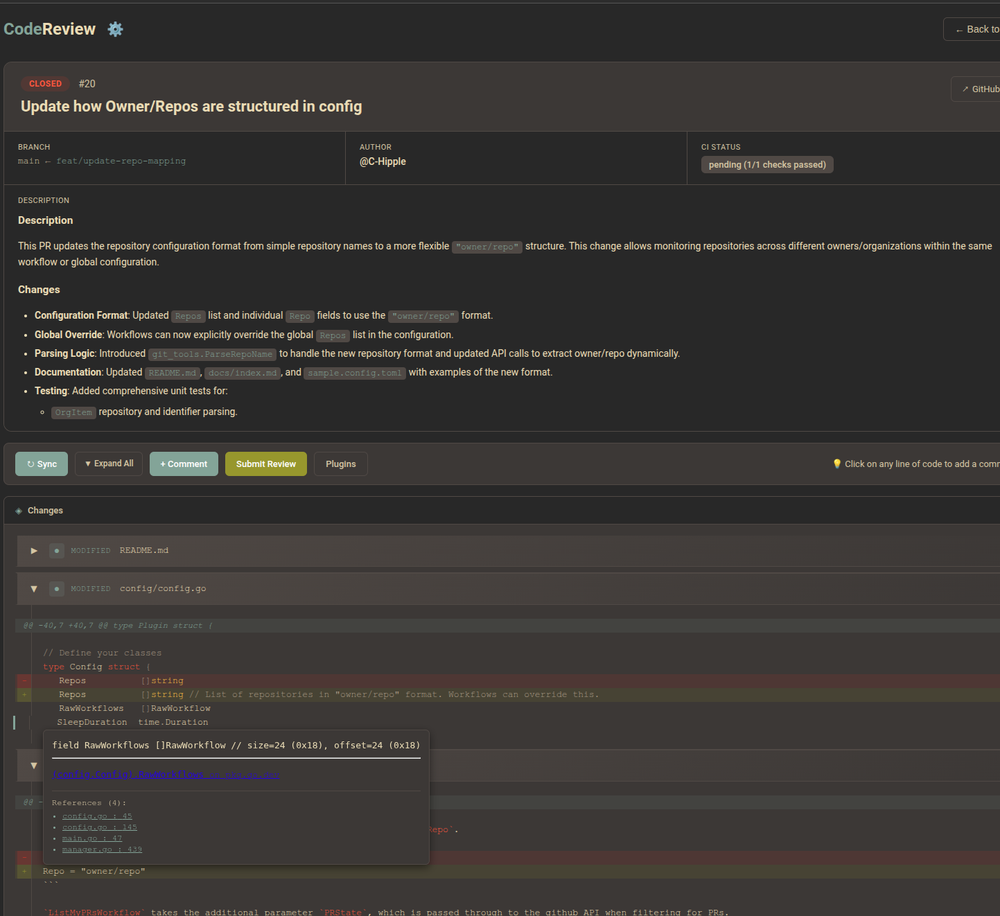
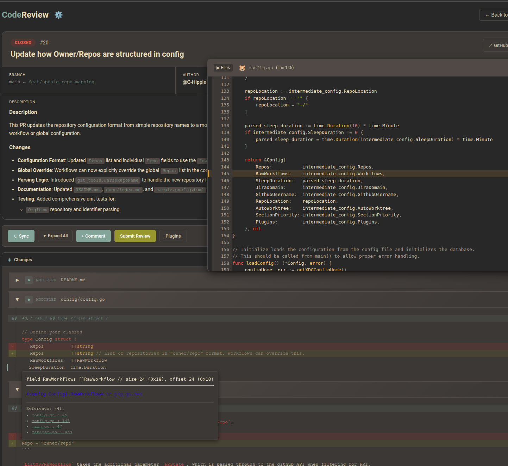
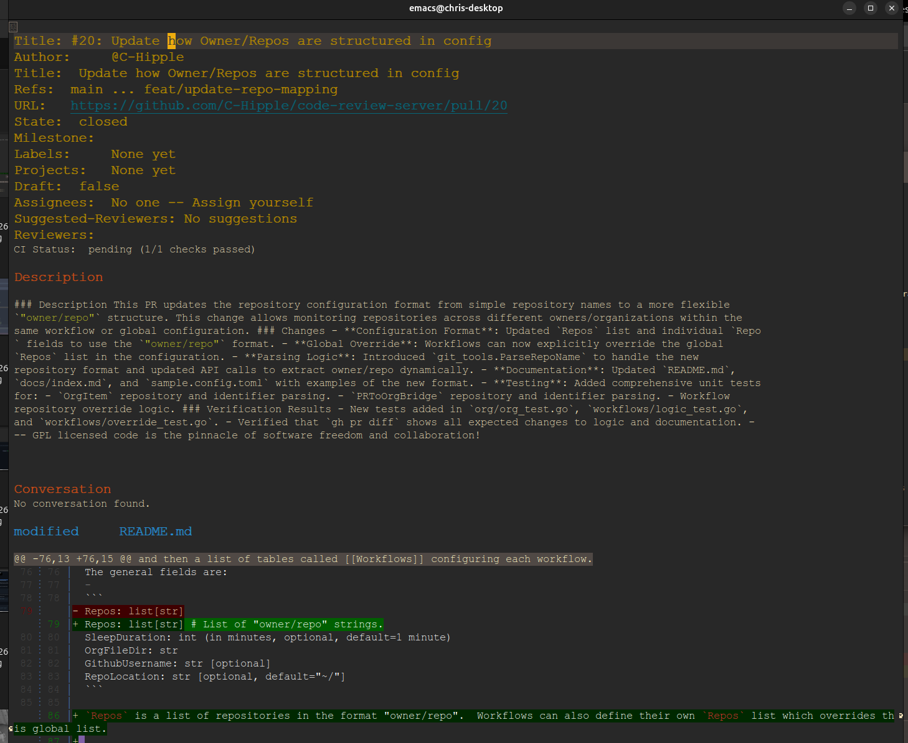
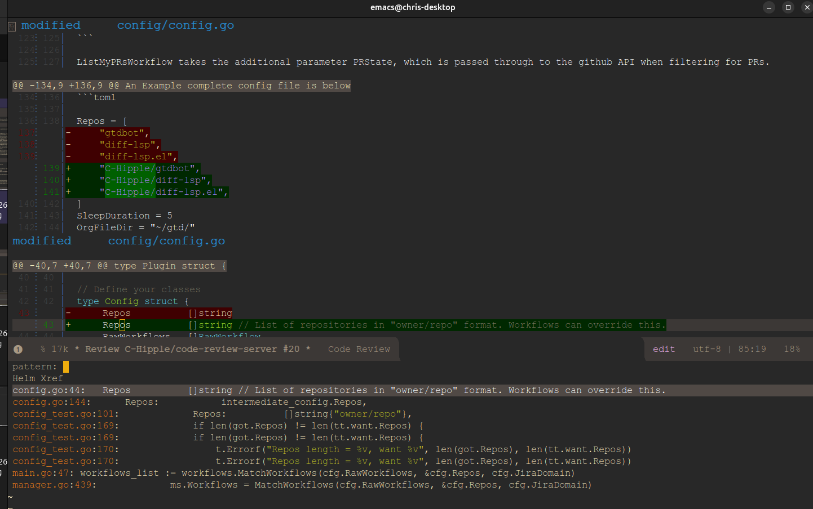

# Reviewing Code

Code Review Server makes the review process fast, customizable, and integrated with your local environment.

## Workflow

From your client (Web or Emacs), you can jump directly from the Pull Request list into a dedicated code review view.

### Fast and Cached
All data is cached locally. This means when you open a review, it loads nearly instantly. You don't have to wait for GitHub API calls to fetch diffs or comments every time you switch files or reviews.

### Fully Functional
The review environment is fully functional. You can:
- **View Diffs**: See changes with syntax highlighting.
- **Read Comments**: View existing comments from other reviewers inline with the code.
- **Add Comments**: Start a review, add pending comments, and submit them all at once.
- **Reply to Threads**: Engage in discussions directly from the interface.

## LSP Integration
Because the server runs locally and can manage git worktrees, it can integrate with Language Server Protocols (LSP). This allows features like:
- **Go to Definition**: Jump to symbols in the PR code.
- **Hover Information**: See types and documentation.
- **Find References**: Explore codebase usage.

This gives you the power of your full IDE environment while reviewing code, something that is often missing from web-based review tools.
